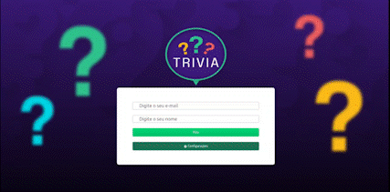

#Trivia Game

Este é um projeto de um jogo de trivia de perguntas e respostas feito com React.js e Redux. Ele permite que os usuários respondam a perguntas de diferentes categorias e níveis de dificuldade. O objetivo é acertar o máximo de perguntas possíveis e pontuar mais que os outros jogadores.

Como executar o projeto
Para executar o projeto, siga os passos abaixo:

Clone este repositório em seu computador
Abra o terminal na pasta do projeto e execute o comando npm install
Após a instalação das dependências, execute o comando npm start
O projeto será executado no seu navegador no endereço http://localhost:3000
Tecnologias utilizadas
Este projeto foi construído utilizando as seguintes tecnologias:

React.js
Redux
HTML/CSS
JavaScript
Como jogar
Ao executar o projeto, você será redirecionado para a tela inicial do jogo. Nesta tela, você realizará o login e será direcionado para tela de game.

Na tela de jogo, você verá uma pergunta e as opções de resposta. Selecione a opção que achar correta e clique nela. Se acertar a resposta, você pontuará e passará para a próxima pergunta. Caso contrário, não ganhará pontos.

Ao finalizar o jogo, você verá a sua pontuação e poderá reiniciar o jogo.

 
 
